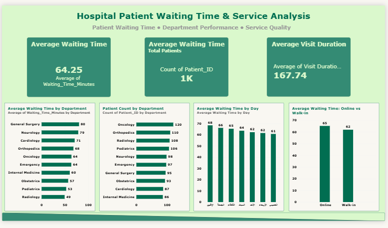

# Hospital Patient Waiting Time Analysis

## Project Parameters

**Project Title:** Hospital Patient Waiting Time Analysis

**Dataset Type:** Synthetic Hospital Patient Dataset

**Sponsor:** Hospital Administration

**Analyst:** Bushra Fawaz Alsubhi

**Project Focus:** Patient waiting times, department performance, and service quality

**Number of Records:** 1,000

---

## Raw Data

The raw dataset contains patient visit information used to analyze waiting times and hospital service performance.

The dataset includes information such as:

- Patient ID
- Patient demographics
- Department
- Appointment details
- Booking type
- Appointment time
- Registration time
- Arrival time
- Provider information
- Provider start time
- Provider end time
- Occupancy information

The raw data was reviewed before analysis to identify missing values, duplicates, and data quality issues.

---

## Data Cleaning Checklist

The following data preparation and cleaning steps were performed:

- Checked for duplicate records.
- Reviewed missing values.
- Checked date and time fields.
- Reviewed categorical values for consistency.
- Verified patient IDs.
- Checked appointment and arrival times.
- Reviewed registration time values.
- Confirmed that missing registration times were expected for online bookings.
- Created calculated fields required for analysis.
- Verified the cleaned dataset before performing analysis.

The dataset contained 699 blank RegistrationTime values. These were treated as expected values because they were associated with online bookings.

---

## Cleaned Data

After completing the data cleaning process, the cleaned dataset was used for analysis.

Additional calculated fields were created to support the analysis, including:

- Waiting Time
- Visit Duration
- Arrival Time Period

The final cleaned dataset contained 1,000 patient records.

---

## Analysis Questions

The analysis was designed to answer questions related to patient waiting times and hospital service performance, including:

1. What is the overall average patient waiting time?
2. Which departments have the highest and lowest average waiting times?
3. Does patient volume appear to be related to waiting time?
4. Which day has the highest average waiting time?
5. How early do patients arrive compared with their scheduled appointment time?
6. How does provider service duration compare with patient waiting time?
7. Does the number of providers have a meaningful relationship with waiting time?
8. Is there a difference in waiting time between online bookings and walk-in patients?
9. How long do patients spend in the hospital on average?
10. What patterns can be identified to support improvements in patient flow and service efficiency?

---

## Analysis

### Overall Waiting Time

The overall average patient waiting time was **64.25 minutes**.

### Average Waiting Time by Department

| Department | Average Waiting Time (Minutes) |
|---|---:|
| General Surgery | 80.26 |
| Neurology | 78.53 |
| Cardiology | 70.86 |
| Orthopedics | 68.22 |
| Emergency | 63.61 |
| Oncology | 64.03 |
| Internal Medicine | 60.34 |
| Obstetrics | 56.95 |
| Pediatrics | 52.72 |
| Radiology | 49.35 |

General Surgery had the highest average waiting time at **80.26 minutes**, while Radiology had the lowest at **49.35 minutes**.

### Patient Count by Department

| Department | Patient Count |
|---|---:|
| Oncology | 120 |
| Orthopedics | 110 |
| Radiology | 108 |
| Pediatrics | 106 |
| Neurology | 98 |
| Emergency | 97 |
| General Surgery | 95 |
| Obstetrics | 93 |
| Cardiology | 87 |
| Internal Medicine | 86 |

Radiology had 108 patients while maintaining a relatively low average waiting time of 49.35 minutes. General Surgery had 95 patients but the highest average waiting time of 80.26 minutes.

### Waiting Time by Day

Monday had the highest average waiting time at **68.47 minutes**, while Thursday had the lowest at **60.79 minutes**.

### Visit Duration

The average visit duration was **167.74 minutes**.

### Arrival Time

Patients arrived an average of **11.52 minutes earlier** than their scheduled appointment time.

### Provider Service Duration

The average provider service duration was **19.19 minutes**, compared with an overall average waiting time of **64.25 minutes**.

### Waiting Time and Visit Duration

The correlation between waiting time and visit duration was **0.626**, indicating a moderate positive relationship.

### Occupancy and Waiting Time

The correlation between occupancy and waiting time was **0.021**, indicating a very weak relationship.

### Providers and Waiting Time

The correlation between the number of providers and waiting time was **-0.006**, indicating no meaningful relationship in this dataset.

### Online Booking vs Walk-in

| Booking Type | Average Waiting Time |
|---|---:|
| Online | 65.22 minutes |
| Walk-in | 61.98 minutes |

The difference was **3.24 minutes**, with online-booked patients having a slightly higher average waiting time.

---

## Insights & Conclusions

1. **Average patient waiting time is 64.25 minutes.**  
   **Evidence:** Average waiting time = 64.25 minutes.  
   **Conclusion:** Reducing waiting time could improve patient experience and service efficiency.

2. **General Surgery has the highest average waiting time, while Radiology has a lower waiting time.**  
   **Evidence:** General Surgery = 80.26 minutes; Radiology = 49.35 minutes.  
   **Conclusion:** Waiting times vary across departments, indicating some departments may require further review of workflow and service processes.

3. **Patient volume does not appear directly related to waiting time.**  
   **Evidence:** Radiology had 108 patients with an average waiting time of 49.35 minutes, while General Surgery had 95 patients with an average waiting time of 80.26 minutes.  
   **Conclusion:** Patient volume alone does not explain differences in waiting times.

4. **Monday has the highest average waiting time.**  
   **Evidence:** Monday average waiting time = 68.47 minutes.  
   **Conclusion:** Waiting times vary across the week, with Monday showing the highest average waiting time.

5. **Patients arrive earlier than their scheduled appointment time.**  
   **Evidence:** Average difference between arrival time and appointment time = -11.52 minutes.  
   **Conclusion:** Early arrival is common in the dataset.

6. **Patients spend considerably more time waiting than receiving direct provider service.**  
   **Evidence:** Average waiting time = 64.25 minutes; average provider service duration = 19.19 minutes.  
   **Conclusion:** Patients spend considerably more time waiting than receiving direct provider service.

7. **The number of providers on shift does not appear to have a meaningful relationship with waiting time.**  
   **Evidence:** Correlation between providers and waiting time = -0.006.  
   **Conclusion:** More providers are not clearly associated with shorter waiting times in this dataset.

8. **Online-booked patients have a slightly higher average waiting time than walk-in patients.**  
   **Evidence:** Online = 65.22 minutes; Walk-in = 61.98 minutes; difference = 3.24 minutes.  
   **Conclusion:** The small difference suggests that booking method does not have a strong effect on waiting time in this dataset.

---

## Recommendations

1. **Review and improve patient flow and workflow in General Surgery and evaluate appointment scheduling based on department waiting-time patterns.**  
   **Basis:** General Surgery has the highest average waiting time at 80.26 minutes.  
   **Benefit:** Better scheduling and patient flow may reduce delays and improve patient experience.

2. **Review the patient waiting process and identify the main stages causing delays before the provider starts service.**  
   **Basis:** Average waiting time is 64.25 minutes compared with an average provider service duration of 19.19 minutes.  
   **Benefit:** Identifying and addressing delay points may reduce waiting time and improve service efficiency.

3. **Review appointment scheduling and patient flow on Mondays to identify and reduce potential delays.**  
   **Basis:** Monday has the highest average waiting time at 68.47 minutes.  
   **Benefit:** Better scheduling and patient flow may reduce waiting times during higher-delay periods.

4. **Monitor waiting times for online-booked and walk-in patients and review the booking process regularly.**  
   **Basis:** Online patients average 65.22 minutes compared with 61.98 minutes for walk-in patients, a difference of 3.24 minutes.  
   **Benefit:** Regular monitoring can identify changes and support future booking improvements.

5. **Compare patient flow and workflow practices across departments and identify practices that may contribute to shorter waiting times.**  
   **Basis:** Radiology had 108 patients with an average waiting time of 49.35 minutes, while General Surgery had 95 patients with an average waiting time of 80.26 minutes.  
   **Benefit:** Identifying effective practices may help departments with longer waiting times improve patient flow and reduce delays.

---

## Power BI Dashboard

The final Power BI dashboard presents the main findings from the analysis, including patient volume, waiting times, visit duration, department performance, daily waiting patterns, and booking type comparisons.

### Power BI File

[Open the Power BI Dashboard](Hospital%20Dashboard.pbix)

---

# Project Workflow

**Project Parameters → Data Preparation → Data Cleaning → Analysis Questions → Analysis → Insights & Conclusions → Recommendations → Power BI Dashboard**

---

## Tools Used

- Microsoft Excel
- Power BI

---

## Conclusion

This project analyzed patient waiting times and service performance using a synthetic hospital dataset of 1,000 patient records.

The analysis found that the overall average waiting time was **64.25 minutes**, with clear differences between departments. General Surgery had the highest average waiting time at **80.26 minutes**, while Radiology had a lower average of **49.35 minutes** despite having 108 patients. This indicates that patient volume alone does not explain differences in waiting times.

Waiting times also varied by day, with Monday showing the highest average waiting time at **68.47 minutes**. Patients arrived an average of **11.52 minutes earlier** than their scheduled appointment time, while the average provider service duration was **19.19 minutes** compared with an overall waiting time of 64.25 minutes.

The analysis also showed that the number of providers had no meaningful relationship with waiting time in this dataset, with a correlation of **-0.006**. Online-booked patients had a slightly higher average waiting time than walk-in patients, but the difference was only **3.24 minutes**.

Overall, the findings highlight opportunities to review patient flow, appointment scheduling, and processes that contribute to delays, particularly in departments and periods with higher waiting times. The Power BI dashboard summarizes the key findings in a visual format to support further review of hospital service performance.

---

**Prepared by Bushra Fawaz Alsubhi**
